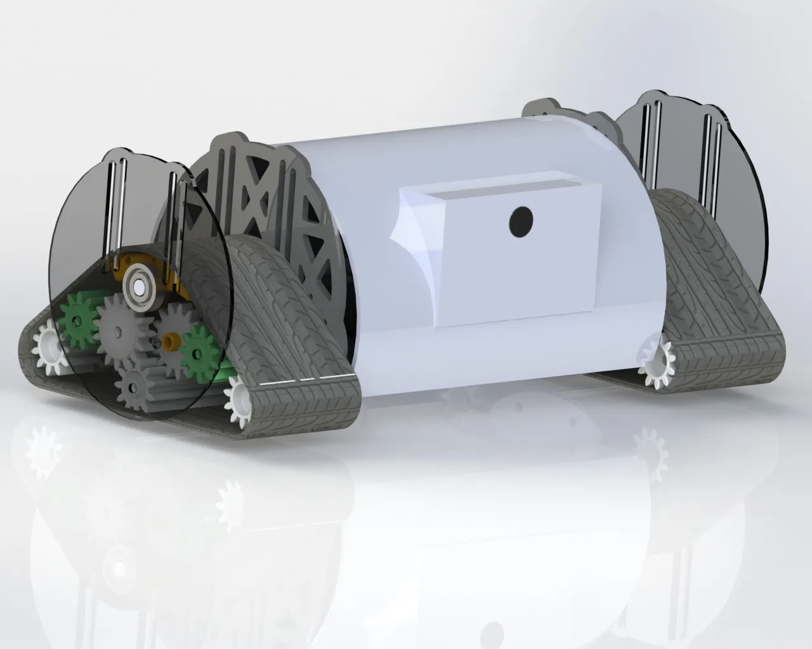
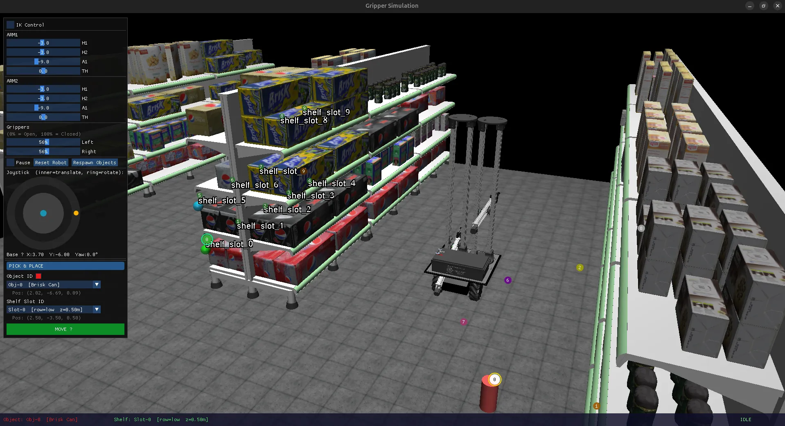
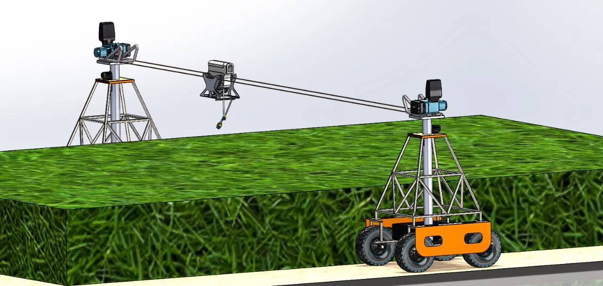

<div align="center">



# 🤖 Jiten Topiwala — Portfolio

**Robotics Engineer** · Founding Robotics Engineer @ Agmove Robotics

Award-winning competition robots · industrial inspection · agricultural automation · published IEEE / IJIRT research

<br>

[](https://jiten-topiwala.github.io/Portfolio/)
[](https://jiten-topiwala.github.io/Portfolio/design-options/)


</div>

---

## 🔗 Links

- **Main site** — [jiten-topiwala.github.io/Portfolio](https://jiten-topiwala.github.io/Portfolio/)
- **Design gallery** — [/Portfolio/design-options/](https://jiten-topiwala.github.io/Portfolio/design-options/)

The design gallery is a set of 10 design explorations of the same portfolio — useful for comparing directions and gathering feedback.

## 🛠 Featured work

<table>
<tr>
<td width="33%" align="center"><br><b>Mobile Manipulator Motion Planning</b><br><sub>OMPL · MuJoCo · pick &amp; place</sub></td>
<td width="33%" align="center"><br><b>ArOne — Agricultural Gantry</b><br><sub>Rope-driven farm-coverage robot</sub></td>
<td width="33%" align="center"><br><b>Miniature Pipe Inspection Robot</b><br><sub>35–95 mm articulated crawler</sub></td>
</tr>
</table>

Full case studies live on the [site](https://jiten-topiwala.github.io/Portfolio/) — this is a taste.

## 📂 Repository layout

```text
Portfolio/
├── index.html            # the live portfolio site
├── styles/               # main.css + responsive.css (live site)
├── scripts/main.js       # live site behaviour
├── content/              # all site content as JSON (see shared/schema.md)
├── shared/
│   ├── content-loader.js # fetch + render helpers for data-driven designs
│   └── schema.md         # content schema — single source of truth
├── design-options/       # 10 design explorations + gallery index
├── Images/               # media referenced from content JSON (relative paths)
├── robots.txt, sitemap.xml
└── .github/              # GitHub Pages workflow
```

## Content system

All portfolio content — projects, experience, publications, awards, skills, services, contact — lives as JSON in [`content/`](content/). Edit a JSON file, and any design built on the loader re-renders automatically. No HTML edits needed to update content.

The full schema (field-by-field, with conventions for images, links, dates, and featured flags) is documented in [`shared/schema.md`](shared/schema.md).

**Data-driven design:** `design-options/option-10-machined-graphite.html` renders entirely from `content/*.json` via [`shared/content-loader.js`](shared/content-loader.js). The current live `index.html` is a static build; the other design options are static mockups.

## Run locally

The data-driven pages fetch JSON, so they must be **served over HTTP** — opening the file directly (`file://`) is blocked by the browser.

```bash
# from the repo root
python3 -m http.server 8000
# then open http://localhost:8000/
#   or   http://localhost:8000/design-options/
```

Or use the VS Code **Live Server** extension. The static `index.html` also works when served.

## SEO

The site is data-driven (JS-rendered), so [`scripts/seo-build.js`](scripts/seo-build.js) bakes crawler-readable SEO into the static files **from the same `content/*.json`** — meta + Open Graph/Twitter, JSON-LD (`Person` + projects + publications), a hidden `#seo-prerender` content block that JS removes on load, plus `llms.txt`, `robots.txt`, and `sitemap.xml`.

```bash
node scripts/seo-build.js   # after editing content or the design; idempotent
```

The GitHub Action runs this automatically on every deploy, so the published site's SEO is always current — you only need to run it locally to preview.

## Deploy

Hosted on **GitHub Pages** via [`.github/workflows/deploy.yml`](.github/workflows/deploy.yml): on push to `main` it bakes SEO, then publishes. Every file is served, so subfolders (like `design-options/`) are reachable at their path (~1 min after push).

> **Contact form:** uses [FormSubmit](https://formsubmit.co). The **first** submission triggers a one-time activation email to the site owner — click it once to start receiving messages.

## Contact

- **Email:** <jitentopiwala7@gmail.com>
- **LinkedIn:** [linkedin.com/in/jiten-topiwala](https://linkedin.com/in/jiten-topiwala)
- **Fiverr:** [fiverr.com/jiten_topiwala](https://www.fiverr.com/jiten_topiwala)
